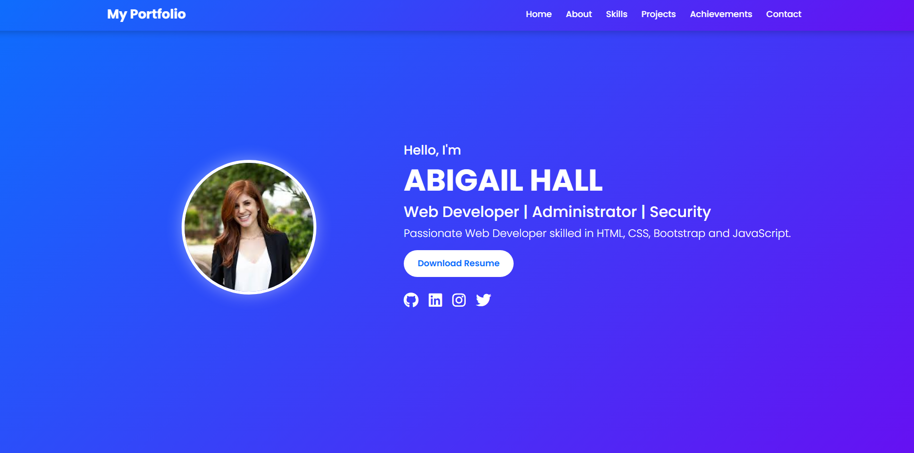
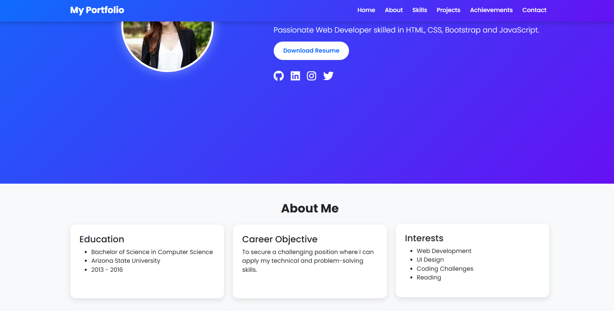
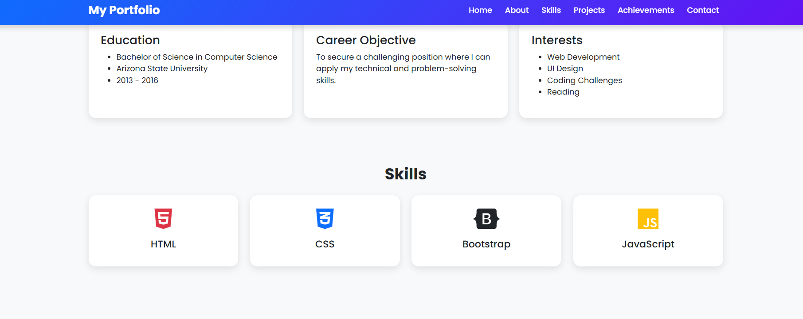
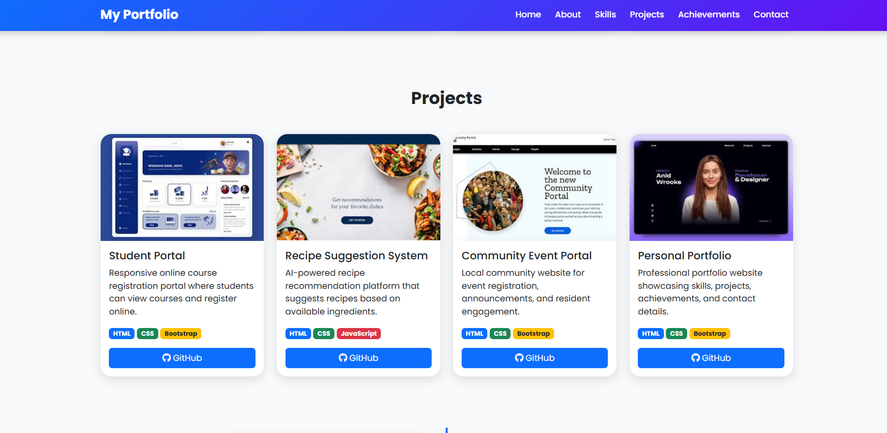
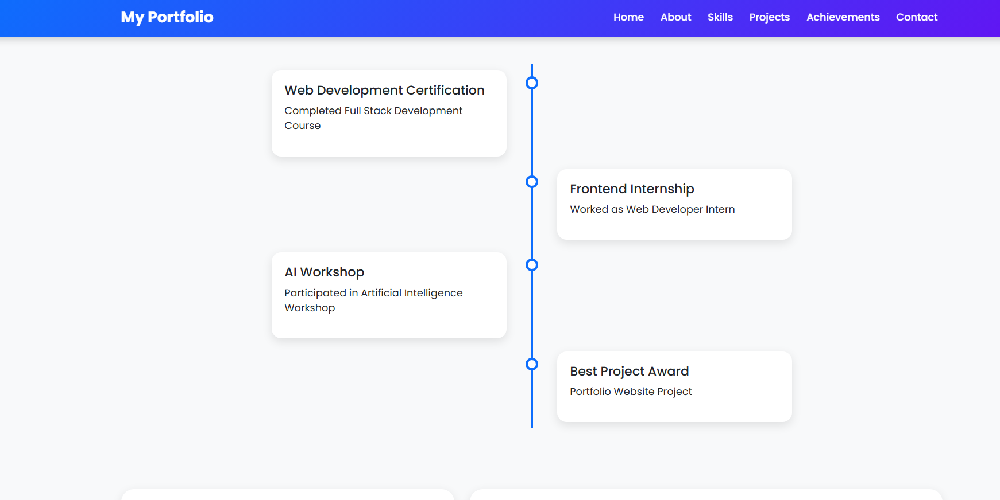
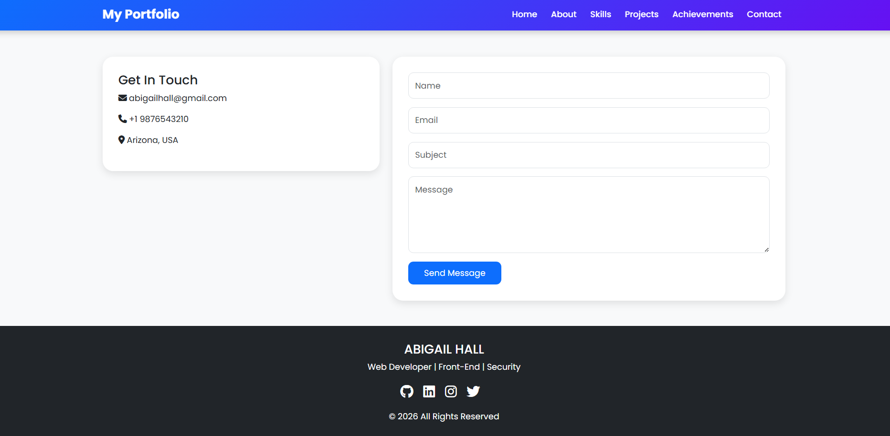
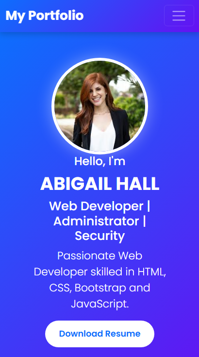
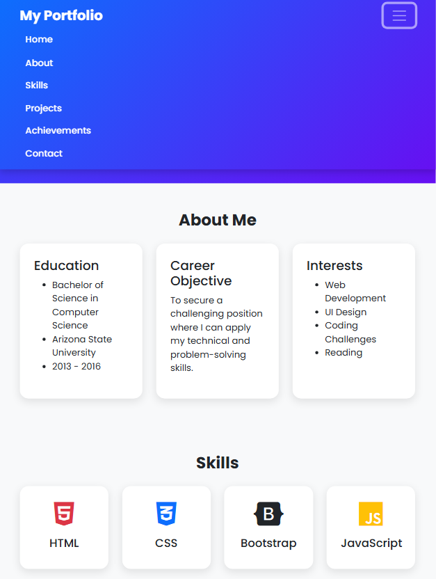

# Personal Portfolio Website

## Project Description

This project is a responsive Personal Portfolio Website developed using HTML5, CSS3, Bootstrap 5, and JavaScript. It showcases personal information, technical skills, projects, achievements, and contact details in a modern and professional layout.

The website is fully responsive and works seamlessly on desktop, tablet, and mobile devices.

---

## Features

### Home Section
- Professional profile introduction
- Profile photograph
- Designation and short bio
- Resume download button
- Social media links

### About Me Section
- Educational qualifications
- Career objective
- Personal interests

### Skills Section
- Skill progress bars
- Technical skill cards
- Responsive layout

### Projects Section
- Four project showcase cards
- Project descriptions
- Technologies used
- GitHub repository links

### Achievements Section
- Certifications
- Workshops
- Internships
- Awards
- Timeline layout

### Contact Section
- Contact information
- Contact form
- Bootstrap modal popup

---

## Technologies Used

- HTML5
- CSS3
- Bootstrap 5
- JavaScript
- Font Awesome

---

## Bootstrap Components Used

- Navbar
- Cards
- Progress Bars
- Forms
- Buttons
- Modal
- Grid System

---

## Folder Structure

```text
Portfolio/
│
├── index.html
├── css/
│   └── style.css
│
├── images/
│   ├── profile.jfif
│   ├── project1.jfif
│   ├── project2.jfif
│   ├── project3.jfif
│   └── project4.jfif
│
├── resume/
│   └── Resume.pdf
│
├── screenshots/
│   ├── home.PNG
│   ├── about.PNG
│   ├── skills.PNG
│   ├── projects.PNG
│   ├── achievements.PNG
│   ├── contact.PNG
│   ├── mobile-view.PNG
│   └── tablet-view.PNG
│
└── README.md
```

---

## Screenshots

### Home Page



### About Section



### Skills Section



### Projects Section



### Achievements Section



### Contact Section



### Mobile View



### Tablet View



---

## Responsive Design

The website is fully responsive and optimized for:

- Desktop Devices
- Tablet Devices
- Mobile Devices

---

---

## Live Demo

 https://navyakammalapally.github.io/Portfolio-website/
